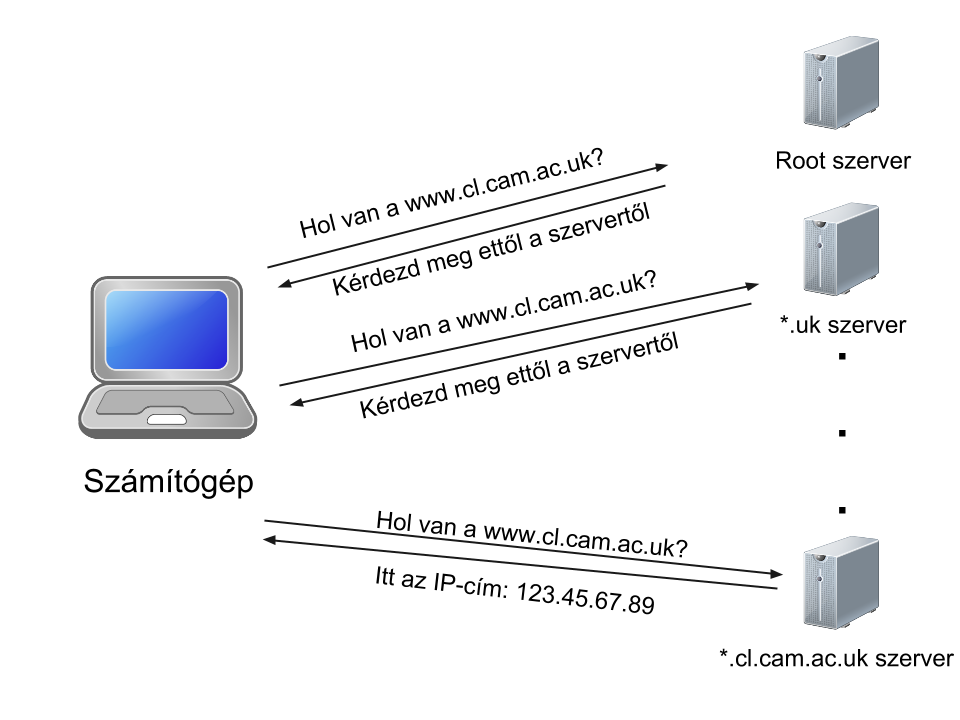
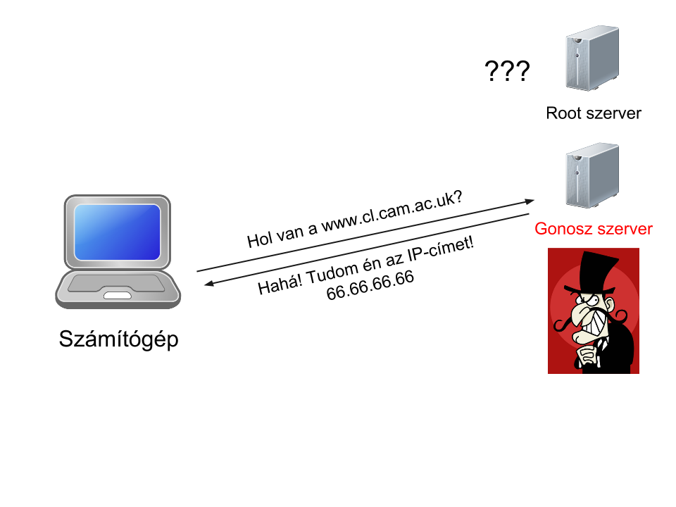
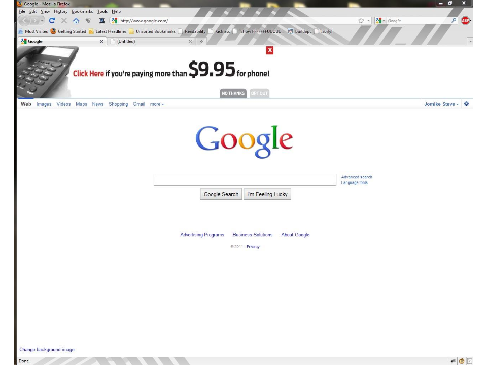

Hálózatok
==========================================

Bevezetés
------------------------

Az interneten már `több mint 1 milliárd <http://www.internetlivestats.com/total-number-of-websites/>`_ weblap van (pontosabban, "unique host"), és ez a szám rohamosan nő. Minden ilyen weblap szervereken én valahol. Ez azt jelenti, hogy a világ minden internetre kötött eszköze az összes többi internetre kötött eszközzel összeköttetésben áll! Ez egy elképesztő, világméretű hálózat. Persze a gépek nem mind közvetlenül vannak összekötve, hanem egy faszerkezetű hálózatban.

.. image:: resources/internet-terkep.png
   :width: 100 %
   :align: center

*Az internet térképe* (`forrás <http://thecreatorsproject.vice.com/blog/what-the-internet-looks-like>`_)

IP-cím (IP Address)
------------------------

Amikor beírok egy weblapcímet a böngészőbe, pl. a www.google.com-ot, akkor hogyan tudja a gépem, hogy melyik másik géphez (szerverhez) kell csatlakoznia?

Előszöris, minden hálózathoz csatlakoztatott géphez tartozik egy azonosítószám: az *IP-cím.* Ez általában egy négy számból álló sor, például: ``216.58.209.68``.

Te is meg tudod nézni, hogy milyen IP-cím tartozik egy weblaphoz, a ``ping`` parancs segítségével (ezt írd bele a terminálodba (Mac/Linux) vagy a parancssorodba (Windows))::

   ➜  ~ ping www.google.com
   PING www.google.com (216.58.209.68): 56 data bytes
   64 bytes from 216.58.209.68: icmp_seq=0 ttl=54 time=41.427 ms
   64 bytes from 216.58.209.68: icmp_seq=1 ttl=54 time=91.787 ms
   64 bytes from 216.58.209.68: icmp_seq=2 ttl=54 time=67.355 ms
   64 bytes from 216.58.209.68: icmp_seq=3 ttl=54 time=45.027 ms

Ha a böngészőbe közvetlenül a kapott IP-címet írod be, akkor is a keresett weblap nyílik meg.

.. note:: A te gépedhez is tartozik egy IP-cím: ha kíváncsi vagy, keress rá arra, hogy `my IP address <https://www.google.hu/?gfe_rd=cr&ei=vIQnWKObO5Ku8wfzvIfQAQ&gws_rd=ssl#q=my+ip+address>`_.

.. note:: A fenti formátumot IPv4-nek hívják. Azonban most már több internetre csatlakoztatott eszköz van, mint létező IPv4-cím, ezért kénytelen volt a világ elkezdeni átállni egy újabb formátumra, az IPv6-re (`itt <https://en.wikipedia.org/wiki/IPv6#Motivation_and_origin>`_ bővebben is olvashatsz erről). Ennek a formátuma így néz ki: ``2001:0db8:0000:0042:0000:8a2e:0370:7334``.

Domain Name System (DNS)
------------------------

Tehát a webcímből (www.google.com) valahogyan IP-cím lesz. Na jó, de honnan tudja a gépem, hogy mi a webcímhez tartozó IP-cím?

Nézzük először, mi is történik amikor telefonálunk valakinek:

* Előszöris van a konkrét eszköz, amit el szeretnénk érni: Péter telefonja
* Ennek van egy azonosítója, a telefonszám: +36 20 744 2372
* De mi nem tudjuk a telefonszámot - mi csak Péter nevét tudjuk. Ezért elővesszük a kontaktlistánkat, és abból kikeressük Péter nevét.

Az internet is hasonlóan működik: el szeretnénk érni egy szervert, annak van egy azonosítója (az IP-cím), de mi csak a webcímét ismerjük. Az internetnek is megvan a saját "telefonkönyve", amit `Domain Name Systemnek (DNS) <https://en.wikipedia.org/wiki/Domain_Name_System>`_ hívnak. Azonban egyetlen "telefonkönyv" helyett ez egy hatalmas, sok szerver között megosztott rendszer.

DNS Resolution
------------------------

Szóval a gépem a DNS rendszer segítségével lefordítja a webcímet egy IP-címre. De hogyan történik ez?

Képzeljük el először, hogy a Google Mapsen szeretnénk kézzel megtalálni egy lakhely címet, pl.::

   1-es szám,
   Oktogon tér,
   Budapest,
   Magyarország,
   Európa

Ezek a címek hierarchikusak: tudjuk, hogy először Európát kell megkeresnünk. Európán belül Magyarországot, Magyarországon belül Budapestet, azon belül az Oktogon teret, és végül csak a téren a 1-es házszámot.

A webcímek is hierarchikusak::

   1-es szám,       www.
   Oktogon tér,     cl.
   Budapest,        cam.
   Magyarország,    ac.
   Európa           uk

Ebben az esetben a cambridge-i Computer Laboratory webcíme öt részből áll: a ``uk`` rész az Egyesült Királyságot jelöli, az ``ac`` rész az oktatási weblapokat ("academic"), a ``cam`` rész Cambridge rövidítése, a ``cl`` rész a Computer Lab rövidítése, végül a ``www`` rész a publikus weblapra utal.

A DNS ezt a hierarchiát használja ki. Az egyetlen világtérképnek megfelelően van egy `root name server <https://en.wikipedia.org/wiki/Root_name_server>`_ (pontosabban ennek van több száz másolata). Ezeknek az IP-címe ismert minden böngésző számára, úgyhogy ettől a böngészőm először megkérdezi, hogy hol van az a name server, ami az ``uk`` címekért felel. Amikor ennek megvan az IP-címe, a böngészőm most az ``ac`` name serverére kérdez rá. Így megy ez addig, amíg meg nem kapjuk a webcímnek megfelelő pontos IP-címet.

IP Routing
------------------------

Akkor most már megvan az IP-cím - de hogyan jut el a lekérés a gépemtől a Google szerveréig?

Az ehhez tartozó technikát *IP routingnak* hívják. A számítógépem közvetlenül csatlakozik egy routerhez. Ebben a routerben van egy táblázat, ami irányjelző táblaként szolgál: ezáltal a router tudja, hogy merre kell tovább menni a kért IP-címhez. A következő routerben már mások az irányjelzők, de a megfelelő irányokat követve végül eljutunk a célszerverig.

Ezt is meg tudjuk nézni. Macen és Linuxon a ``traceroute`` paranccsal, Windowson a ``tracert`` paranccsal::

   ➜  ~ traceroute www.google.com
   traceroute to www.google.com (216.58.209.68), 64 hops max, 52 byte packets
    1  csp1.zte.com.cn.t.hu (192.168.1.254)  4.810 ms  2.761 ms  2.066 ms
    2  145.236.238.167 (145.236.238.167)  16.380 ms  16.366 ms  17.187 ms
    3  81.183.3.6 (81.183.3.6)  17.085 ms  17.103 ms  16.985 ms
    4  81.183.3.4 (81.183.3.4)  22.562 ms
       81.183.3.0 (81.183.3.0)  17.164 ms  17.317 ms
    5  81.183.3.129 (81.183.3.129)  16.795 ms
       81.183.3.133 (81.183.3.133)  18.564 ms
       81.183.3.129 (81.183.3.129)  17.078 ms
    6  80.150.168.41 (80.150.168.41)  37.798 ms
       193.159.167.17 (193.159.167.17)  33.969 ms
       80.157.128.109 (80.157.128.109)  42.100 ms
    7  217.239.41.118 (217.239.41.118)  39.910 ms
       217.239.41.130 (217.239.41.130)  38.351 ms
       72.14.242.110 (72.14.242.110)  34.062 ms
    8  74.125.50.149 (74.125.50.149)  40.102 ms  33.852 ms  33.754 ms
    9  66.249.94.86 (66.249.94.86)  30.340 ms
       66.249.94.88 (66.249.94.88)  45.117 ms
       216.239.57.194 (216.239.57.194)  33.549 ms
   10  216.239.57.241 (216.239.57.241)  37.525 ms
       209.85.142.17 (209.85.142.17)  30.836 ms  33.575 ms
   11  209.85.252.29 (209.85.252.29)  36.195 ms
       209.85.254.199 (209.85.254.199)  37.477 ms
       209.85.254.60 (209.85.254.60)  36.033 ms
   12  209.85.241.230 (209.85.241.230)  44.200 ms
       209.85.244.67 (209.85.244.67)  38.543 ms
       209.85.241.1 (209.85.241.1)  37.449 ms
   13  waw02s06-in-f68.1e100.net (216.58.209.68)  37.473 ms
       209.85.252.29 (209.85.252.29)  40.857 ms
       209.85.254.199 (209.85.254.199)  41.230 ms

DNS hijacking
------------------------

Ezek a komponensek persze sebezhetőek is.

Például egy rosszindulatú résztvevő beépíthet hamis name servereket, amik rossz IP-címeket adnak meg. Ezt *DNS hijackingnek* hívják.

Ezt ki is lehet próbálni. A gépeden ugyanis vannak fájlok, amikben át lehet írni a webcímeket és a hozzájuk tartozó IP-címet. Például kipróbálhatod a következőt:

#. Mondjuk hogy a www.index.hu címet beírva a www.444.hu oldal szeretnénk behozni.
#. A ``ping`` parancs segítségével határozd meg a www.444.hu IP-címét.
#. Nyisd meg a hosts file-t.

  #. Windows: ``C:\Windows\System32\Drivers\etc\hosts`` (fontos, hogy a Notepadet Adminisztrátor módban futtasd)
  #. Linux: ``/etc/hosts``
  #. Mac: ``/private/etc/hosts`` vagy ``/etc/hosts``

#. Írj be egy új sort. Például: ``111.111.111.111 www.index.hu``
#. Mentsd el a fájlod.
#. A böngészőben a www.index.hu címet betöltve most a www.444.hu töltődik be.

  #. Megjegyzés: sajnos nem mindig működik, ugyanis a böngészők sokszor megjegyzik a webcímeket és IP-címeket. Ilyenkor néha segít, ha törlöd a tárolt információkat.

ISP content hijacking
------------------------

Ezenkívül bármelyik router is küldhet vissza hamisított adatokat. Az alábbi képen például az internetszolgáltató reklámot szúrt be a Google oldalába:

Ezek ellen persze lehet védekezni, és ezért ez manapság már nem fordul elő - de ezekről majd egy másik alkalommal beszélünk.

Kommunikáció és lapbetöltés, HTTP
------------------------

Most már értjük, hogy hogyan lép a böngésző kapcsolatba a szerverrel. De honnan tudja, hogy mit jelenítsen meg?

Ahhoz, hogy a két számítógép sikeresen kommunikáljon egymással, tudniuk kell, hogy milyen kérdéseket és válaszokat várhatnak egymástól. Ezt az úgynevezett *protokollok* határozzák meg. A weblapok betöltéséhez a *HTTP* (Hypertext Transfer Protocol) és a *HTTPS* (HTTP Secure) protokollokat használják a böngészők.

Íme egy példa egy ilyen kommunikációra. A következő *request* lekéri az ``index.html`` lapot a ``www.example.com`` címről::

  GET /index.html HTTP/1.1
  Host: www.example.com

Ez a *request header,*, ami a lekérési metódust (``GET``) tartalmazza, a lekért lapot (``/index.html``), a protokoll pontos verzióját (``HTTP/1.1``) és a célzott hostot.

Erre pedig a szerver küldi a *response-t*, ami tartalmazza a kért információt, a megjelenítendő HTML kódot::

  HTTP/1.1 200 OK
  Date: Mon, 23 May 2005 22:38:34 GMT
  Content-Type: text/html; charset=UTF-8
  Content-Encoding: UTF-8
  Content-Length: 138
  Last-Modified: Wed, 08 Jan 2003 23:11:55 GMT
  Server: Apache/1.3.3.7 (Unix) (Red-Hat/Linux)
  ETag: "3f80f-1b6-3e1cb03b"
  Accept-Ranges: bytes
  Connection: close
  
  <html>
  <head>
    <title>An Example Page</title>
  </head>
  <body>
    Hello World, this is a very simple HTML document.
  </body>
  </html>

Itt a *response header* megint tartalmazza a protokollt, de egy egyszerű válasz kódot it (``200 OK``), a dátumot, a válasz típusát stb. A *response body* pedig a konkrét HTML-t tartalmazza.

Ez persze egy nagyon egyszerű példa: egy bonyolultabb weblapnál a HTML után le kell tölteni a stílusfájlokat, a javascriptet, és a képeket is. Ezt meg is tudod nézni ha megnyitod a böngésződ Web Developer Console-jának a Network tabjét és frissíted a weboldalt.

.. note:: Amikor a Facebookot betöltöd, csak az alapinformációk jelennek meg. Ahhoz, hogy megtudd, hogy egy posztot kik lájkoltak, a böngészőnek új lekéréseket kell küldeni a Facebook szervereknek. Találd meg a Network taben a like információ requestjét és response-át! Mit látsz a válaszban?

Webappok
------------------------

Most már világosabb lesz, hogy hogyan is működnek a webappok, pl. a Facebook. A *frontend* az az app, ami a böngésződben fut: ez HTML, CSS, és JavaScript keveréke. Amikor a frontend valami információt szeretne betölteni, pl. mert ráklikkeltél az üzenetek gombra, akkor nem tölti le az egész weboldalt újra, hanem csak az üzenetek megjelenítéséhez szükséges információt tölti be - mégpedig úgy, hogy küld egy requestet a *backend*-nek.

A backend itt a webszervert takarja. Ez egy folyamatosan futó program, aminek annyi a dolga, hogy az érkező requesteket fogadja, feldolgozza, majd arra response-okat küldjön. A feldolgozás persze lehet bonyolult: a Facebook esetében ellenőrizni kell, hogy van jogod az adott üzenetek olvasásához, az adatbázisokból be kell tölteni az információt, majd azt a megfelelő formátumba kell tenni a visszaküldéshez. A webszervert tipikusan Javában, Pythonban (pl. Django), illetve ritkábban JavaScriptben (pl. node.js) és régebben PHP-ban írják.

Továbbiak
------------------------

A későbbiekben lesz még szó a portokról, a POST requestekről, és a sütikről (cookies) is.